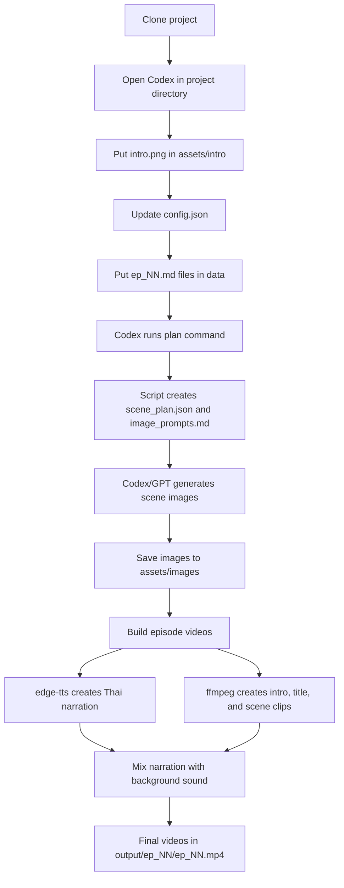

# Thai Audiobook YouTube Pipeline

This project turns Thai novel episode files in `data/` into YouTube-ready audiobook videos.

Output format:

1. First 6 seconds: your intro screen plus welcome narration.
2. Title screen: `เรื่อง {novel name} ตอนที่ {ep N} {ep name}` with text-to-speech narration.
3. Main reading: one generated image per scene, Thai narration, no subtitles.
4. Background sound is looped quietly under the narration.

The pipeline uses local scripts, `edge-tts`, `ffmpeg`, and Codex/GPT image generation. It does not require an OpenAI API key.

## Requirements

- macOS, Linux, or Windows with a shell.
- Python 3.10 or newer.
- `ffmpeg`.
- Codex app or Codex CLI pointed at this project directory.
- Internet connection for `edge-tts`.

Install `ffmpeg` on macOS with Homebrew:

```bash
brew install ffmpeg
```

## First-Time Setup

1. Clone this project.

```bash
git clone <repo-url> thai-novel-openai
cd thai-novel-openai
```

2. Create and activate a Python virtual environment.

```bash
python3 -m venv .venv
. .venv/bin/activate
pip install -r requirements.txt
```

3. Open Codex and point it to this directory.

Example directory:

```text
/Users/whaikung/Documents/thai-novel-openai
```

4. Add your intro screen.

Put your image here:

```text
assets/intro/intro.png
```

You can also use `intro.jpg`.

5. Update `config.json`.

Important fields:

```json
{
  "novel_name": "YOUR_NOVEL_NAME",
  "intro_text": "ยินดีต้อนรับเข้าสู่ T-H-A-I Channel ขอให้สนุกกับการรับฟังนะครับ",
  "voice": "th-TH-NiwatNeural",
  "intro_seconds": 6,
  "title_seconds": 5,
  "scene_tail_trim_seconds": 0,
  "trim_trailing_silence": false,
  "background_volume": 0.08
}
```

Keep `scene_tail_trim_seconds` as `0` and `trim_trailing_silence` as `false` unless you know you want to change audio timing. These settings prevent Thai words from being cut at the end of a scene.

6. Put story files under `data/`.

Single episode:

```text
data/ep_01.md
```

Multiple episodes are supported:

```text
data/ep_01.md
data/ep_02.md
data/ep_03.md
...
```

7. Tell Codex to generate videos.

Recommended prompt:

```text
Please generate video in /Users/whaikung/Documents/thai-novel-openai.
Use the saved settings in AGENTS.md and build all episodes in data.
Generate missing scene images first, then build the videos.
```

## Markdown Format

Recommended format:

```markdown
---
novel_name: ชื่อนิยาย
ep_name: ชื่อตอน
---

# ชื่อนิยาย

## ตอนที่ 1 - ชื่อตอน

เนื้อหาตอนนี้...
```

You can also add scene headings manually:

```markdown
## Scene 1
เนื้อหาฉากแรก...

## Scene 2
เนื้อหาฉากต่อไป...
```

If scene headings are not included, the script automatically splits long text into scene-sized chunks.

## Video Creation Flow



Short version:

```text
data/ep_01.md
  -> scene plan + image prompts
  -> generated scene images
  -> Thai narration + intro screen + spoken title screen + background sound
  -> output/ep_01/ep_01.mp4
```

## Manual Commands

Activate the environment first:

```bash
cd /Users/whaikung/Documents/thai-novel-openai
. .venv/bin/activate
```

Create image prompts for one episode:

```bash
python3 scripts/audiobook_video.py plan data/ep_01.md
```

This creates:

```text
output/ep_01/scene_plan.json
output/ep_01/image_prompts.md
```

Generate or replace the reusable background sound:

```bash
python3 scripts/audiobook_video.py bg
```

Build one episode:

```bash
python3 scripts/audiobook_video.py build data/ep_01.md
```

Build every `data/ep_*.md` episode:

```bash
python3 scripts/audiobook_video.py build-all
```

Output files:

```text
output/ep_01/ep_01.mp4
output/ep_02/ep_02.mp4
...
```

## Scene Images

Scene images should be saved here:

```text
assets/images/ep_01_scene_001.png
assets/images/ep_01_scene_002.png
assets/images/ep_02_scene_001.png
...
```

Codex can generate these from each episode's `image_prompts.md`.

## Useful Commands

Allow temporary placeholder images when generated images are missing:

```bash
python3 scripts/audiobook_video.py build data/ep_01.md --allow-placeholders
```

List Thai Edge TTS voices:

```bash
edge-tts --list-voices | grep th-TH
```
