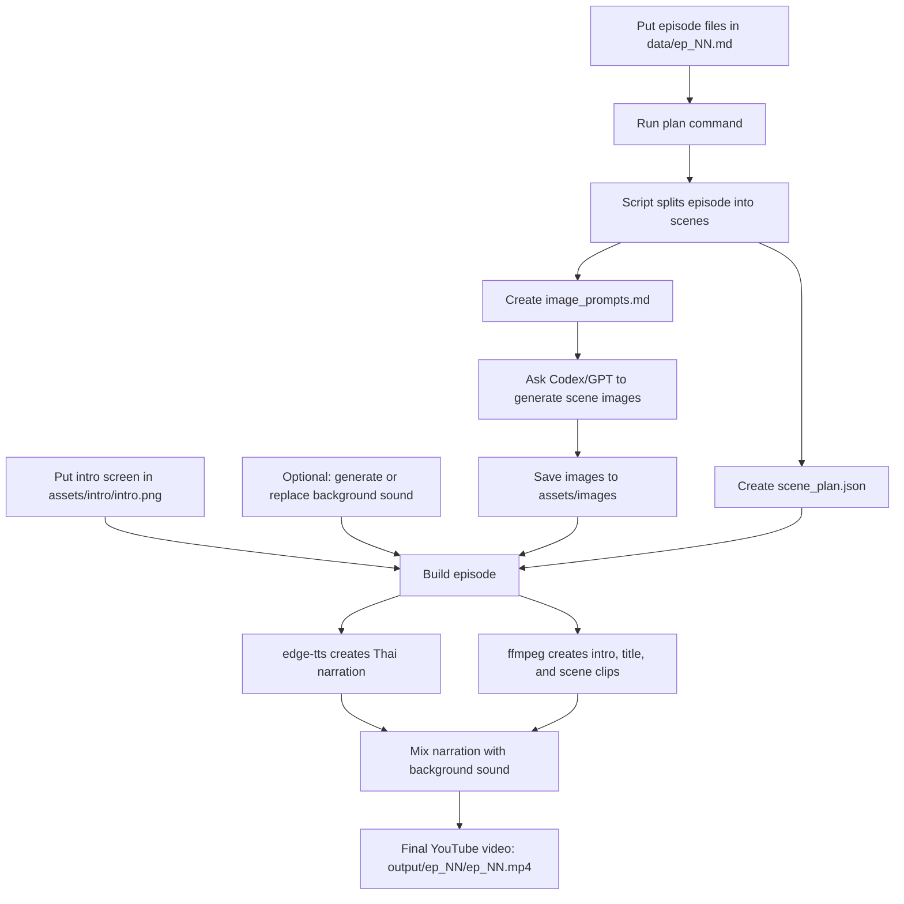

# Thai Audiobook YouTube Pipeline

This project turns `data/ep_NN.md` into a YouTube-ready audiobook video:

1. First 6 seconds: your intro screen plus welcome narration.
2. Title screen: `เรื่อง {novel name} ตอนที่ {ep N} {ep name}` with narration.
3. Reading starts: one image per scene, narration audio, no subtitles.
4. Optional reusable background music is generated locally once and looped quietly.

## Video Creation Flow



Short version:

```text
data/ep_01.md
  -> scene plan + image prompts
  -> generated scene images
  -> Thai narration + intro screen + spoken title screen + background sound
  -> output/ep_01/ep_01.mp4
```

## Setup

```bash
cd "/Users/whaikung/Documents/thai-novel-openai"
python3 -m venv .venv
. .venv/bin/activate
pip install -r requirements.txt
```

You also need `ffmpeg`. It is already installed on this Mac.

## Put Files Here

- Episode markdown: `data/ep_01.md`, `data/ep_02.md`, ...
- Intro image: `assets/intro/intro.png` or `intro.jpg`
- Generated scene images: `assets/images/ep_01_scene_001.png`, etc.

## Markdown Format

Recommended:

```markdown
# ชื่อตอน

## Scene 1
เนื้อหาฉากแรก...

## Scene 2
เนื้อหาฉากต่อไป...
```

If you do not add scene headings, the script splits long paragraphs into scene-sized chunks automatically.

You can also set metadata at the top:

```markdown
---
novel_name: ชื่อนิยาย
ep_name: ชื่อตอน
---
```

## Step 1: Create Scene Plan And Image Prompts

```bash
python3 scripts/audiobook_video.py plan data/ep_01.md
```

This creates:

- `output/ep_01/scene_plan.json`
- `output/ep_01/image_prompts.md`

Then ask Codex:

> Generate all scene images from `output/ep_01/image_prompts.md` and save them into `assets/images`.

The pipeline itself does not call an OpenAI image API, so it does not need an API key.

## Step 2: Generate Background Sound Once

```bash
python3 scripts/audiobook_video.py bg
```

This creates `assets/background/ambient_loop.wav`. If you prefer real music, replace that file with your own background track.

## Step 3: Build One Episode

```bash
python3 scripts/audiobook_video.py build data/ep_01.md
```

Output:

```text
output/ep_01/ep_01.mp4
```

## Useful Commands

Build every episode in `data`:

```bash
python3 scripts/audiobook_video.py build-all
```

For a new Codex session, say:

```text
Please generate video in /Users/whaikung/Documents/thai-novel-openai.
Use the saved settings in AGENTS.md and build all episodes in data.
```

Allow temporary placeholder images when generated images are missing:

```bash
python3 scripts/audiobook_video.py build data/ep_01.md --allow-placeholders
```

Use another Thai Edge voice:

```bash
edge-tts --list-voices | grep th-TH
```
